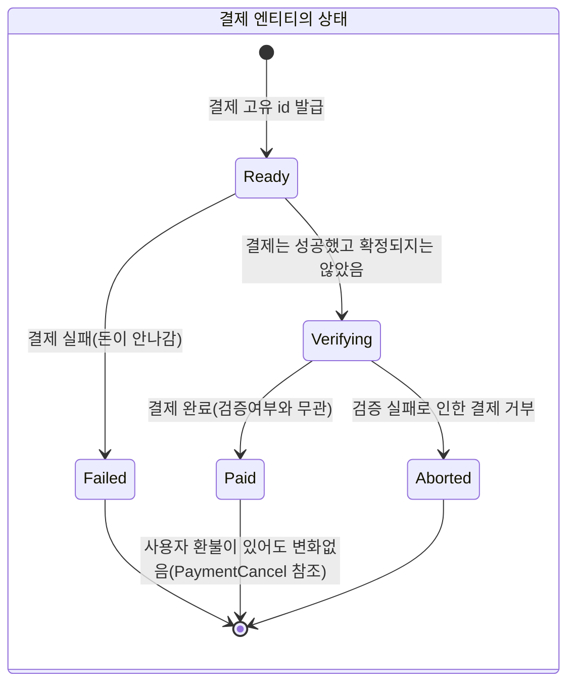

```mermaid
stateDiagram-v2
    state "결제 엔티티의 상태" as Payment{
        [*] --> Ready : 결제 고유 id 발급
        Ready --> Failed : 결제 실패(돈이 안나감)
        Ready-->Verifying: 결제는 성공했고 확정되지는 않았음
        Verifying --> Paid : 결제 완료(검증여부와 무관)
        Verifying --> Aborted : 검증 실패로 인한 결제 거부
        Aborted --> [*]
        Failed --> [*]
        Paid --> [*] : 사용자 환불이 있어도 변화없음(PaymentCancel 참조)
    }
```
